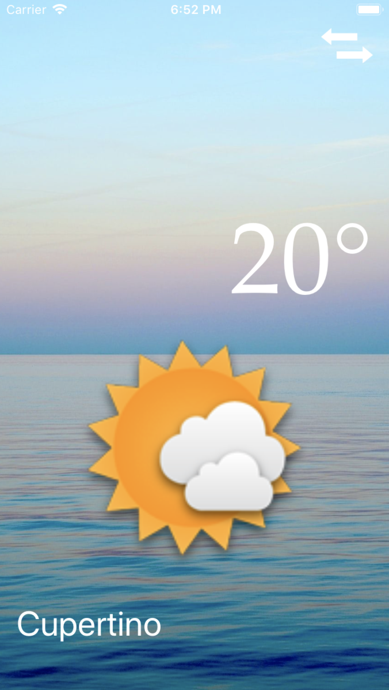
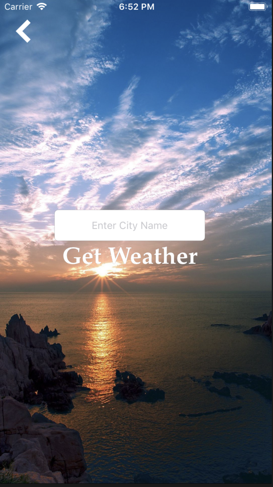

# Climate Live

## The App

Climate Live is a location-aware weather app that will find out where you are in the world and query an open source weather service to retrieve data about the current weather conditions. Also, you can change the city at the tap of a button!

## What I learned

- Using CocoaPods to access open source code libraries
- Using public web-based APIs to fetch data
- Learning about Networking calls and Core Location as well as utilising the iPhone’s inbuilt GPS
- Supported navigation between View Controllers using Segues; passing data between View Controllers.

## Finished App

## Possible Extensions

- Displaying a 5-day weather forecast at user's current location or any other cities
- Displaying data such as UV Index and air pollution 
